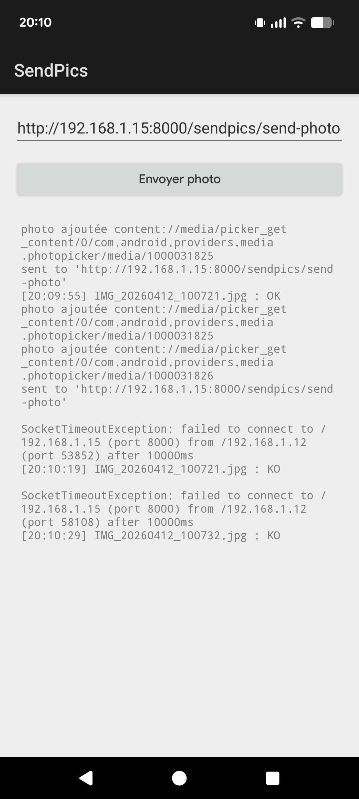

# installation


Telecharger commandlinetools-linux-14742923_latest.zip sur https://developer.android.com/tools?hl=fr

Dans le bashrc. Note : sdk manager s'attend VRAIMENT a avoir un dossier "latest"

```
if [ -d "$HOME/programmes/android-sdk" ] ; then
  export ANDROID_SDK_ROOT="$HOME/programmes/android-sdk"
  export PATH=$PATH:$ANDROID_SDK_ROOT/cmdline-tools/latest/bin
  export PATH=$PATH:$ANDROID_SDK_ROOT/build-tools/34.0.0
  export PATH=$PATH:$ANDROID_SDK_ROOT/platform-tools
fi
```

Avoir java 21

```
sdkmanager "platforms;android-34" "build-tools;34.0.0" "platform-tools"
```

# compiler et envoyer l app:

```
./build.sh

adb devices

adb install build/app-signed.apk

# (Réinstaller si déjà présent)
adb install -r build/app-signed.apk

adb shell am start -n com.equipothee.helloworld/.MainActivity
```

# Backend

Pour le moment le backend ne fait rien d autre que de montrer qu'il a recu les data

```
python simple_backend.py
```

# demo




# Troubleshoot :

Pour que android fonctionne sous wsl :

Tout d abord, j avais un cable "de charge" donc pas de data sous powershell lsusb ensuite :

```
powershell en mode admin : 
PS C:\Users\tgauthier> usbipd list
Connected:
BUSID  VID:PID    DEVICE                                                        STATE
2-1    18d1:4ee2  Pixel 7, Android Composite ADB Interface                      Shared

PS C:\Users\tgauthier> usbipd attach --wsl --busid 2-1
usbipd: info: Using WSL distribution 'Ubuntu-22.04' to attach; the device will be available in all WSL 2 distributions.
usbipd: info: Loading vhci_hcd module.
usbipd: info: Detected networking mode 'nat'.
usbipd: info: Using IP address 192.168.144.1 to reach the host.


ensuite sous wsl :


adb kill-server
adb devices
List of devices attached
2C051FDH2000FV  no permissions (missing udev rules? user is in the plugdev group); see [http://developer.android.com/tools/device.html]

~/programmes/partage-mariage/sendpic/front-android
lsusb
Bus 002 Device 001: ID 1d6b:0003 Linux Foundation 3.0 root hub
Bus 001 Device 002: ID 18d1:4ee2 Google Inc. Nexus/Pixel Device (MTP + debug)
Bus 001 Device 001: ID 1d6b:0002 Linux Foundation 2.0 root hub

echo 'SUBSYSTEM=="usb", ATTR{idVendor}=="18d1", MODE="0666", GROUP="plugdev"' | sudo tee /etc/udev/rules.d/51-android.rules
SUBSYSTEM=="usb", ATTR{idVendor}=="18d1", MODE="0666", GROUP="plugdev"
sudo chmod a+r /etc/udev/rules.d/51-android.rules
sudo udevadm control --reload-rules
sudo udevadm trigger
adb kill-server
adb devices

```
