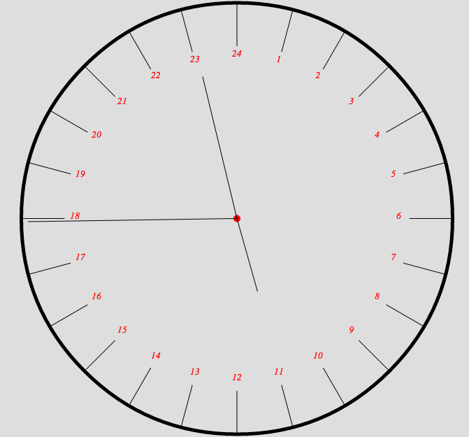

canvas2d_24oclock
=================

Just an attempt to learn/test canvas2d. And I always wanted to see a 24 hours o'clock (instead of 12).

It's all pure javascript
no other parts, no pictures.

Here it was 10h57 am :

TODO :
- Change all french part to English
- refactor
- only redraw the pointer (to hours min sec) not the entire screen
- mae it beautiful ?
