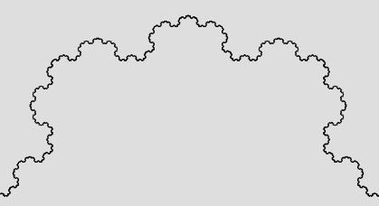
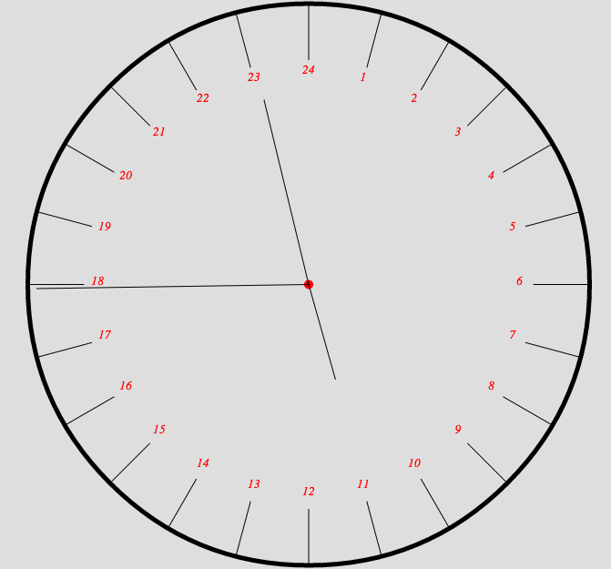
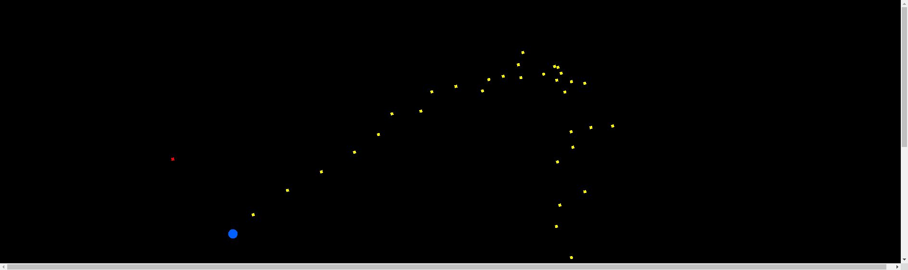

# Install

```
npm ci
```

# Start

```
npm start
```

go to http://localhost:5173/

# Screenshots






# Canvas robots :

use vim mapping : `h j k l SPACE`

or classical : `up right down left SPACE`

# Pixi evolution

Play with Pixi.js

http://pixijs.download/release/docs/index.html

Le but : construire une structure :

Tourner avec gauche droite

appuyer sur espace

puis agrandir / retrecir avec haut bas

TODO :

Ensuite faire un algo genetique qui choisi celui qui monte le plus haut.

# Pixi play function

Play with Pixi.js

https://pixijs.io/examples/#/demos-basic/container.js

http://pixijs.download/release/docs/index.html

Affiche des fonctions de math pour faire avancer des trucs dessus

````
# press left right up
````
